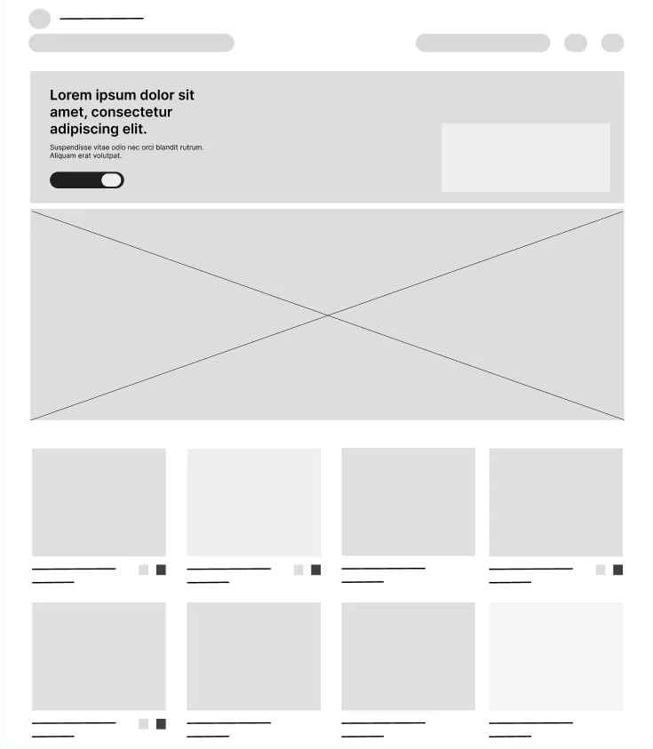

# Reto E-commerce - Nodejs 🚀

### Proyecto Ecommerce desarrollado en Nodejs
#### 🔧 Stack: TypeScript - Express - Node - TypeORM - PostgreSQL - Nextjs - React - Tailwind - Redux-toolkit

### Forma de la información que tendrá el sistema
#### 📦 Ejemplo de producto (JSON)

```json
{
  "id": "123",
  "name": "Camisa logo ",
  "imageUrl": "imageulr t-shirt",
  "stock": 13,
  "price": 89.000,
  "category": "Camisas",
  "size": ["M", "L", "X", "XX", "XL"],
  "colors": ["negro", "blanco", "azul"],
}
```
### 🎉 Muckup

##    